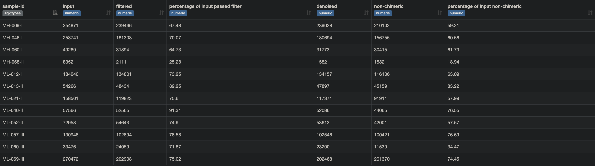
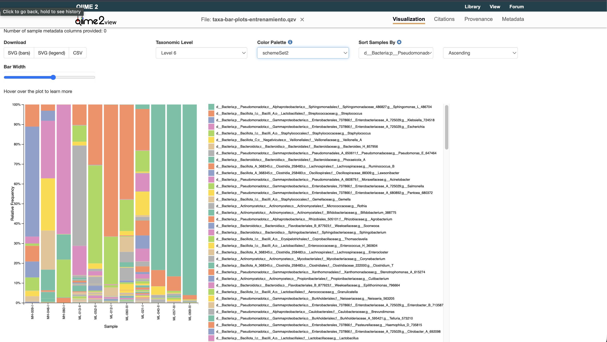

# **Qiime 2 Amplicon**          


En este entrenamiento veremos las funciones necesarias para correr un pipeline basado en qiime para metabarcoding y amplicones. Estas funciones han sido inspiradas y modificadas desde el tutorial de [moving-pictures](https://amplicon-docs.qiime2.org/en/stable/tutorials/moving-pictures/). Los invito a revisar el material de tutoriales que ellos tienen para entender más a fondo los comandos. 

## Demultiplexing

En Metabarcoding se acostumbra a secuenciar gran cantidad de muestras de manera simultánea. La razón de esto: tiempo, facilidad, dinero etc. Si todo esta mezclado y secuenciado a la vez como se diferencian las muestras entre si? Esto lo logramos mediante los indexes que añadimos antes de la secuenciación. Estos funcionan como un código de barras (de ahi viene el nombre). 

En nuestro caso, las secuencias de illumina ya salen demultiplexeadas (un archivo Fastq por muestra). Para qué hacemos demultiplex entonces? Esto ya que el demux tools import command, nos va a brindar mas información además de cual muestra es cual. Además, Qiime no puede trabajar con secuencias crudas. La herramienta solo va a poder realizar calculos sobre artefactos de qiime (los .qza).

Entonces, demux nos va a brindar información acerca de: cantidad de reads, claidad, tamaño del amplicon, entre otros. 

Esta información nos va resultar muy útil para siguientes pasos. 


```
qiime tools import \
        --type 'SampleData[SequencesWithQuality]' \
        --input-path samples_dir \
        --input-format CasavaOneEightSingleLanePerSampleDirFmt \
        --output-path demux.qza
```
Algo importante de notar aqui es el flag `--input-format CasavaOneEightSingleLanePerSampleDirFmt` Este es el formato de sencuencias que sua illumina, pero cuidado con cambiar los nomrbes de las secuencias, ya que si se altera el formato e intentan importar sus secunecias con este flag va a dar error.

El formato a seguir es el siguiente: 

[SampleID]_[BarcodeID]_L[LaneNumber]_R[Direction]_001.fastq.gz

Este formato lo van a ver mucho en sus muestras y un ejemplo de ello es esta: 

03jun2022_MH-014-III_S6_L001_R1_001.fastq.gz 

Como ven puedo poner cualquier cosa para identificación de la muestra como la fecha, año numero de participante, trimestre etc. Siempre y cuando no altere nada del BarcodeID en adelante. 

> [!Note]
> Es posible incluir BarCodeIDs en este caso. Como ya las muestras estan diferenciadas no pasa nada con cambiar este numero sea la razón que necesiten.

Ahora, nosotros no podemos ver un archivo qza (hay maneras pero no es tan sencillo), es necesario crear un resumen o archivo visualisable (qzv). Para esto, usaremos el siguiente código

```
    qiime demux summarize \
        --i-data demux.qza \
        --o-visualization demux.qzv 
```

Esto nos generara un archov el cual podemos descargar y ver utilizando la página [Qiime2-View](https://view.qiime2.org/). En esta nada más es necesario arrastrar el archivo descargado a la casilla para ver nuestros resultados. 

{width=50%}

## DADA2 - denoising 

> [!WARNING] No es recomendable mezclar el trimming de DADA2 con otras herramientas como trimmomatic o fastp, ya que el trimming que hacen estas secuencias mediante Sliding Window, MinLen o sus algoritmos internos puede interferir con el algoritmo de DADA2, llevando a que este se equivoque y descarte secuencias que de otra manera no serían descartadas
 
El DADA2 es un algoritmo de denoising que nos permitirá varias funciones. 

1. **Realizar un truncamiento de las secunecias para eliminar la parte que tenga baja calidad**

Al evaluar del demux.qzv podemos apreciar donde la caldiad empieza a bajar singificativamente. Nosotros podemos asignar un punto de corte a partir de donde las secuencias se van a truncar. 

Este punto de corte es crucial balancear entre calidad y longitud de la sencuencia, especialmente cunado se trabaje con paired-end reads, ya que es necesario dejar un espacio para el merge de las secuencias

> [!Note] Un punto útil para mantener el merge es la siguiente formula: (trunc_len_f + trunc_len_r) - amplicon_length. Este numero debe de ser idealmente mínimo 20 

2. **Algoritmo de DADA2**

El algoritmo de DADA2 aprende de los errores de las secuencias (errores asociados a la secuenciación), genera un denoising y dereplicación. 

Lo mejor que se puede hacer para este algoritmo es trabajar con datos de una sola corrida, así DADA2 puede aprender acerca de los errores de esta corrida en específico y solucionarlos de la mejor manera. Sin embargo por nuestro contexto a veces eso no es posible. 

La dereplicación que hace es básicamente agrupar secuencias que sean iguales para contar solamente la cantidad que se dio esta secuencia. Esto lo hace con propóstio de aplicar las correcciones estadisticas a esa muestra en lugar de aplicarla a 20 secuencias iguales una por una. 

Luego algoritmo de DADA2 viene a identificar que es real y que no. En resumen, identifica posibles secuencias diferentes y corre cálculos estadísticos para determianr si 2 secuencias de verdad son distintas o una es solo un eror de la otra. 

Por último viene la remoción de Quimeras. Una Quimera es el resultante de un fallo en la PCR, no la secuenciación. Es cuando una hebra de ADN hibrida con una secuencia de otro gen 16s que fue parcialmente amplificado. Generando así una hebra de ADN que contiene un pedazo de una bacteria y otro pedazo de otra. DADA2 identifica cuando esto sucede y elimina los resultados de chimeras. 

A continuación podemos ver el comando que nos ayudara con DADA2:

```
qiime dada2 denoise-single \
  --i-demultiplexed-seqs demux.qza \
  --p-trim-left 15 \
  --p-trunc-len 150 \
  --p-max-ee 3 \
  --p-trunc-q 2 \
  --p-n-threads 0 \
  --o-table table.qza \
  --o-base-transition-stats base-transition-stats.qza \
  --o-representative-sequences rep-seqs.qza \
  --o-denoising-stats stats.qza
```

De igual manera vamos a generar objetos de visualización para poder verificar nuestros datos para sigueintes partes del pipeline. 

```
qiime feature-table tabulate-seqs \
  --i-data rep-seqs.qza \
  --o-visualization rep-seqs.qzv

qiime feature-table summarize \
  --i-table table.qza \
  --o-sample-frequencies sample-frequencies.qza \
  --o-feature-frequencies feature-frequencies.qza \
  --o-summary table.qzv

qiime metadata tabulate \
  --m-input-file stats.qza \
  --o-visualization stats.qzv

```

Cada uno de estos nos va a brindar infromación importante 

### Table

En esta tabla veremos la cantidad de secuencias o ASVs que sobrevivieron el filtrado por DADA2 

{width=50%}

### Denoising Stats

Vamos a ver estadísticas del proceso de denoising más a detalle. Como lo explicado anteriormente, vamos a ver los distintos pasos de filtrado, el input, lo filtrado (basandose en cortes que le establecimos y una calidad mínima promedio), denoising (aprendido de nuestras muestras), non chimeric y las que pasaron todos los filtros. Idealmente que pasen entre un 70%-80% de los reads es lo mejor. Igualmente van a haber unas que pasen con menos pero que igual me van a generar una buena cantidad de reads por ciertos factores en la secuenciación. 

{width=50%}

### Representative Sequences

Las representative sequences de nuestro output son básicamente todas aquellas secuencias que pasaron por el filtro de DADA2 y que asoció a algún ASV. Tener en cuenta que aún no hemos asignado nuestra taxonomía, pero estas son importantes para hacerlo. 

{width=50%}

## Greengenes2 - Non-v4-16s Data 

> [!WARNING] Esta parte es opcional para aquellas personas que no trabajen con mezclas de amplicones o amplicones de bacterias unicamente v4. Greengenes 2 esta especializado a bacterias por lo cual aplicar estos comandos a metabarcoding de hongos, parasitos o helmintos no brindara resultados fiables. Utilizar estos comandos para este tipo de datos puede brindar resultados poco confiables. 

A continuación vamos a ver un herramienta que nos ayude a mezclar tipos de muestra y analizar de una manera más robusta datos provenientes de diferentes lados. 

La herramienta llamada greengenes2 es una optimización de la antigua greengenes en conjunto con una recopilación de otras bases de datos como GTDB usando nomenclatura híbrida. 

Este plugin de qiime permite estandarizar trabajos de metagenomica y metabarcoding, empleado principalmente par estudios en donde se empleen distintas regiones del gen 16s. 

Este funciona mediante el emparejamiento de nuestras secunecias a un backbone: un esqueleto filogenético de secunecias completas del gen 16s. 

Lo que alinée con cada backbone hereda la filogenética y datos del gen 16s contra el que alineó, permitiendonos así eliminar ruidos producidos por comparar diferentes amplicones o por metagenomas secuneciados por shotgun.

Para esto va a ser necesario primero fusionar todas nuestras tablas y secuencias de la siguiente manera. 

```
qiime feature-table merge \
  --i-tables table-v3v4.qza table-heces.qza table-v4.qza\
  --o-merged-table table-a-merged.qza

  qiime feature-table merge-seqs \
  --i-data rep-seqs-v4.qza rep-seqs-v3v4.qza rep-seqs-heces.qza \
  --o-merged-data rep-seqs-a-merged.qza
```
Luego vamos a realizar el comando que nos va a servir para trabajar con secunecias ajenas al v4 (ya que tenemos una mezcla de secunecias tanto de zonas: hece y leche. Como mezcla de amplicones: V3V4 y V4). Para este comando necesitaremos el archivo backbone que lo pueden descargar dando click [aqui](https://ftp.microbio.me/greengenes_release/current/2024.09.backbone.full-length.fna.qza)

```
qiime feature-table summarize \
  --i-table table-a-merged.qza \
  --o-summary table-a-merged.qzv \
  --o-feature-frequencies feature-frequencies-merged.qza \
  --o-sample-frequencies sample-frequencies-merged.qza

qiime greengenes2 non-v4-16s \
  --i-table table-a-merged.qza \
  --i-sequences rep-seqs-a-merged.qza \
  --i-backbone 2024.09.backbone.full-length.fna.qza \
  --o-mapped-table table-gg2.qza \
  --o-representatives rep-seqs-gg2.qza
```

Perfecto, ahora que ya tenemos nuestros objetos de gg2 podemos continuar con el filtrado como normalmente se realizaría normalmente para cualquier otro pipeline de qiime, a excepción de un par de modificaciones. 

## Filtrado Final

Para nuestras secuencias al final nos encontramos con secuencias con muy pocos features/reads, algunas de estas muestras tendrán que ser eliminadas. Por más de que estos reads si pasaron los filtros de DADA2, no es confiable realizar asumciones acerca de la microbiota de una muestra con tan pocas observaciones. 

Sin embargo, atnes tenemos que comparar nuestras secunecias que se encuentran en el arbol de referencia taxonómico de GG2. Este lo podemos descargar [aqui](https://ftp.microbio.me/greengenes_release/current/2024.09.phylogeny.asv.nwk.qza)

El comando necesario para filtrar por el arbol es el siguiente: 

> [!Note] Tenemos que generar un objeto de taxonomía a partir de la tabla de nuestros datos para futuros calculos. Importante hacer esto al principio porque este objeto ayuda a eliminar dominios no deseados como Eukaryota, archaea, mitocondrias, cloroplastos. 

Generamos el objeto de taxonomía. Es necesario usar el arbol taxonomico proporcionado por greengenes2 disponible [aquí](https://ftp.microbio.me/greengenes_release/current/2024.09.taxonomy.asv.nwk.qza)

```
qiime greengenes2 taxonomy-from-table \
  --i-reference-taxonomy 2024.09.taxonomy.asv.nwk.qza \
  --i-table table-gg2.qza \
  --o-classification taxonomy-gg2.qza

```

Luego realizamos el filtrado por el arbol filogenetico de greengenes2.

```
qiime greengenes2 filter-features \
  --i-feature-table table-gg2.qza \
  --i-reference 2024.09.phylogeny.id.nwk.qza \
  --o-filtered-feature-table table-gg2-filtered.qza 

qiime feature-table summarize \
  --i-table table-gg2-filtered.qza \
  --o-summary table-gg2-filtered.qzv \
  --o-feature-frequencies feature-frequencies-merged-final.qza \
  --o-sample-frequencies sample-frequencies-merged-final.qza

```

> Generamos una tabla resumen para poder visualizarlo pero esto es omitible en caso de que no requieran ver la tabla de nuevo

Luego pasamos con los filtros por cantidad de reads. Esto nos va a eliminar las secunecias que tengan unos reads menores al valor establecido. Para estos ejemplos usaremos 5000pb.

```
qiime feature-table filter-samples \
  --i-table table-gg2-filtered.qza \
  --p-min-frequency 5000 \
  --o-filtered-table filtered-table.qza

```
A continuación vamos a filtrar por la frecuencia de estos reads. Basicamente, si un ASV aparece muy pocsas veces en las muestras, lo más probable sea ruido (proveniente de alguna contaminación o alguna mutación), entonces aquí estamos aplicando un filtro más para quitar este ruido: En este caso cualquier ASV que salga menos de 10 veces

```
qiime feature-table filter-features \
  --i-table filtered-table.qza \
  --p-min-frequency 10 \
  --o-filtered-table feature-frequency-filtered-table.qza

```

Luego, vamos a realizarle los filtros taxonomicos, para esto es que necesitamos el objeto de taxonomía. En este caso realizamos 2 filtos de archaea porque qiime a veces no funciona en el primero. 

```
qiime taxa filter-table \
  --i-table feature-frequency-filtered-table.qza \
  --i-taxonomy taxonomy-gg2.qza \
  --p-exclude mitochondria,chloroplast,eukaryota,archaea \
  --o-filtered-table table-clean.qza

qiime taxa filter-table \
  --i-table table-clean.qza \
  --i-taxonomy taxonomy-gg2.qza \
  --p-exclude "d__archaea" \
  --o-filtered-table table-final-clean.qza


```

Luego realizamos exactamente lo mismo de filtros pero para las secuencias de las muestras. Notar que aqui el comando es ligeramente diferente ` --qiime taxa filter-seqs `

```
qiime taxa filter-seqs \
  --i-sequences rep-seqs-gg2.qza \
  --i-taxonomy taxonomy-gg2.qza \
  --p-exclude mitochondria,chloroplast,eukaryota \
  --o-filtered-sequences rep-seqs-clean.qza

qiime taxa filter-seqs \
  --i-sequences  rep-seqs-clean.qza \
  --i-taxonomy taxonomy-gg2.qza \
  --p-exclude "d_archaea" \
  --o-filtered-sequences rep-seqs-final-clean.qza

```

Por último ya podemos generar un objeto de visualización. Este será un gráfico de barras en donde podremos visualizar las abundancias de nuestras muestras. 

```
qiime taxa barplot \
  --i-table table-final-clean.qza \
  --i-taxonomy taxonomy-gg2.qza \
  --o-visualization taxa-bar-plots.qzv

```
Este se puede visualizar de nuevo en la página de qiime. Se debe de ver algo como esto. 



Adicionalmente, los analisis de alfa y beta diversidad se pueden realizar utilizando Qiime2. Sin embargo, para efectos de nuestro laboratorio, estos análisis los realizaremos en R y el código será a conveniencia de las muestras de cada una dependiendo de los tiempos de muestreo, metadata y otros factores. 


